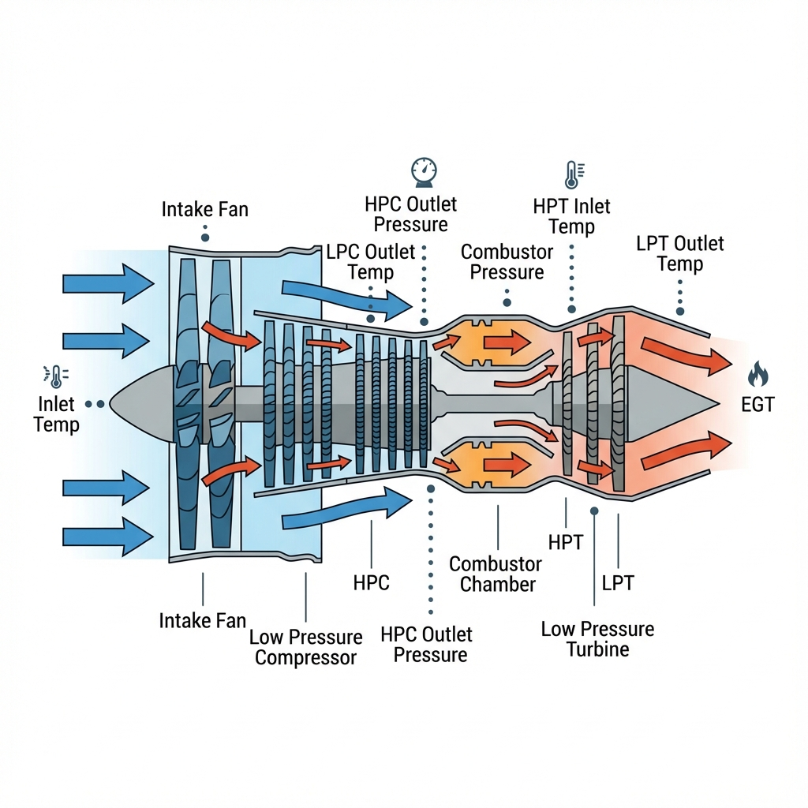

# NASA Turbojet Predictive Maintenance Platform

[](https://python.org)
[](https://streamlit.io)
[](https://docker.com)
[](LICENSE)

## 🚀 Production-Quality Big Data Analytics Platform for C-MAPSS Turbofan Engine Degradation

A comprehensive **Big Data Analytics Platform** integrating **MongoDB**, **Hadoop/HDFS**, **Apache Hive**, **MapReduce on YARN**, and **Machine Learning** for predictive maintenance of NASA's C-MAPSS turbofan engines.



---

## 📌 Project Overview

- **Data Source**: NASA C-MAPSS (Commercial Modular Aero-Propulsion System Simulation) Turbofan Engine Degradation Dataset
- **Objective**: Predict **Remaining Useful Life (RUL)** of jet engines using big data technologies
- **Key Features**: 
  - **MongoDB Integration**: Optimized schemas, batch ingestion, CRUD operations, advanced aggregations
  - **Hadoop/HDFS/MapReduce**: Complete file management, MapReduce jobs on YARN cluster
  - **HiveQL Queries**: 20 comprehensive analytical queries demonstrating data warehousing capabilities
  - **ML Pipeline**: Random Forest Regressor for RUL prediction with feature engineering

---

## 🏗️ Architecture & Tech Stack

### **Frontend**
- **Streamlit**: Professional tab-based UI with 8 main sections
- **Plotly**: Interactive visualizations and dashboards
- **Custom CSS**: Premium dark theme with animations

### **Big Data Storage**
- **MongoDB**: Primary storage with compound indexes for multivariate time series
  - Collections: `BDA_Project.sensors`
  - Batch insertion with 1000 records/batch
  - 8+ advanced aggregation pipelines for analytics

### **Data Warehousing**
- **Hadoop HDFS**: Distributed file storage
  - Directory structure: `/bda_project/processed/{train|test|rul}/`
  - Docker-based deployment with NameNode and DataNode
- **Apache Hive**: SQL interface over HDFS
  - External tables: `cmapss_train`, `cmapss_test`, `cmapss_rul`
  - 20 pre-built analytical queries

### **Distributed Processing**
- **MapReduce on YARN**: Jobs execute on Hadoop YARN cluster
  - Cycle Counter: Count cycles per engine
  - Feature Summary: Statistical summary of all 26 features
  - RUL Averaging: Average RUL calculations

### **Machine Learning**
- **Scikit-Learn**: Random Forest Regressor
- **Feature Engineering**: 24 features (3 settings + 21 sensors)
- **Model Versioning**: Saved as `.pkl` files per dataset

---

## 📂 Project Structure

```
NASATurbojet-BigDataAnalysis-using-HDFS-and-Hive/
├── CMAPSS/                          # Raw NASA datasets
│   ├── train_FD001.txt              # Training data
│   ├── test_FD001.txt               # Test data
│   ├── RUL_FD001.txt                # Ground truth RUL
│   └── ... (FD002, FD003, FD004)
├── backend/                         # Core business logic
│   ├── config.py                    # Comprehensive configuration
│   ├── mongo_manager.py             # MongoDB operations (CRUD + aggregations)
│   ├── hdfs_manager.py              # HDFS file management
│   ├── hive_manager.py              # Hive tables + 20 HiveQL queries
│   ├── mapreduce_manager.py         # MapReduce job execution on YARN
│   ├── data_ingestion.py            # ETL pipeline
│   └── model_service.py             # ML training & inference
├── mapreduce_jobs/                  # MapReduce job scripts
│   ├── mr_cycle_counter.py          # Count cycles per engine
│   ├── mr_feature_summary.py        # Feature statistics
│   └── mr_rul_avg.py                # RUL averaging
├── models/                          # Serialized ML models
├── app.py                           # Main Streamlit application
├── requirements.txt                 # Python dependencies
├── docker-compose.yml               # Hadoop/Hive/MongoDB containers
├── README.md                        # This file
├── SETUP_GUIDE.md                   # Detailed setup instructions
├── HIVEQL_QUERIES.md                # HiveQL query documentation
└── architecture.md                  # System architecture documentation
```

---

## 🎯 Features & Capabilities

### **1. Data Ingestion Pipeline**
- Automatic scanning of CMAPSS directory
- Data cleaning (variable whitespace → CSV)
- Metadata injection (dataset_id, dataset_type)
- Dual upload: MongoDB + HDFS
- Progress tracking and validation

### **2. Data Exploration**
- Interactive sensor trend visualization
- Statistical summaries (min, max, mean, std)
- Correlation heatmaps
- Individual engine unit deep dive
- Support for all 4 datasets (FD001-FD004)

### **3. MongoDB Analytics**
- **Health Scores**: Multi-sensor health index calculation
- **Degradation Analysis**: Early vs late cycle comparison
- **Condition-Based Metrics**: Performance by operating conditions (FD002, FD004)
- **Real-time Aggregations**: Sub-second query response

### **4. HDFS Management**
- File browser with metadata display
- Upload/download operations
- Directory management (create, delete)
- Storage usage statistics

### **5. HiveQL Queries**
20 Pre-built Analytical Queries including:
- Filtering & grouping operations
- Statistical aggregations
- Window functions
- Joins and anomaly detection
- Feature engineering queries

### **6. MapReduce Jobs (YARN)**
Execute distributed MapReduce jobs on the Hadoop YARN cluster:
- **Cycle Counter**: Count operational cycles per engine
- **Feature Summary**: Statistical summary for all sensors
- **RUL Averaging**: Calculate average RUL values

### **7. RUL Prediction**
- Model training with progress tracking
- Hyperparameter configuration
- Real-time inference
- RUL trajectory visualization

---

## 🚀 Quick Start

### **Prerequisites**
- **Python 3.9+**
- **Docker Desktop** (for Hadoop/Hive containers)
- **8GB RAM** (recommended)

### **Installation**

#### 1. Clone Repository
```bash
git clone https://github.com/YOUR_USERNAME/NASATurbojet-BigDataAnalysis-using-HDFS-and-Hive.git
cd NASATurbojet-BigDataAnalysis-using-HDFS-and-Hive
```

#### 2. Install Python Dependencies
```bash
pip install -r requirements.txt
```

#### 3. Start Docker Containers
```bash
docker-compose up -d
```

Verify containers are running:
```bash
docker ps
```

You should see: `namenode`, `datanode`, `hive-server`, `mongodb`

#### 4. Run the Application
```bash
streamlit run app.py
```

The app will open in your browser at `http://localhost:8501`

---

## 📊 Dataset Information

### **C-MAPSS Datasets**

| Dataset | Train Engines | Test Engines | Operating Conditions | Fault Modes | Description |
|---------|---------------|--------------|---------------------|-------------|-------------|
| **FD001** | 100 | 100 | 1 | 1 | Single condition, HPC degradation |
| **FD002** | 260 | 259 | 6 | 1 | Multiple conditions, HPC degradation |
| **FD003** | 100 | 100 | 1 | 2 | Single condition, HPC + Fan degradation |
| **FD004** | 248 | 249 | 6 | 2 | Multiple conditions, HPC + Fan degradation |

### **Data Characteristics**
- **26 columns** per observation:
  - `unit_number`: Engine ID
  - `time_cycles`: Operational cycle
  - `op_setting_1, op_setting_2, op_setting_3`: Operating conditions
  - `sensor_1` through `sensor_21`: Sensor measurements
- **Multivariate time series**
- **Engines start healthy** and degrade over time
- **Objective**: Predict RUL at any given cycle

---

## 💡 Usage Workflow

### **Step 1: Data Ingestion**
1. Place CMAPSS data files in `/CMAPSS` directory
2. Navigate to **Data Ingestion** tab
3. Click **Run Full Ingestion Pipeline**
4. Wait for completion (progress tracked in real-time)

### **Step 2: Initialize Hive Tables**
1. Go to **HiveQL Queries** tab
2. Click **Initialize Hive Tables**
3. Verify successful creation

### **Step 3: Explore Data**
1. **Data Exploration** tab: Visualize sensor trends
2. **MongoDB Analytics** tab: View health scores and degradation
3. **HDFS Management** tab: Browse uploaded files

### **Step 4: Run Analytics**
- Execute any of the **20 pre-built HiveQL queries**
- Run **MapReduce jobs on YARN** for distributed processing
- Check results and performance metrics

### **Step 5: Train ML Model**
1. Navigate to **RUL Prediction** tab
2. Select dataset (e.g., FD001)
3. Click **Start Training**
4. Wait for training completion

### **Step 6: Make Predictions**
1. In **RUL Prediction** → **Prediction** tab
2. Enter engine unit number
3. Click **Predict RUL**
4. View predicted remaining useful life

---

## 🛠️ Troubleshooting

### **Docker Containers Not Starting**
```bash
# Check Docker is running
docker info

# Restart all containers
docker-compose down
docker-compose up -d
```

### **MongoDB Connection Issues**
```bash
# Check MongoDB container
docker ps | grep mongodb

# View MongoDB logs
docker logs mongodb
```

### **HDFS Not Accessible**
```bash
# Check namenode container
docker ps | grep namenode

# View namenode logs
docker logs namenode
```

### **MapReduce Jobs Failing**
- Ensure HDFS has data uploaded first
- Check YARN is running: `docker exec namenode yarn node -list`
- View job logs in the UI

---

## 📚 Additional Resources

- [CMAPSS Dataset Documentation](https://data.nasa.gov/Aerospace/CMAPSS-Jet-Engine-Simulated-Data/ff5v-kuh6)
- [Apache Hive Documentation](https://hive.apache.org/)
- [MongoDB Aggregation Guide](https://docs.mongodb.com/manual/aggregation/)
- [Hadoop MapReduce Tutorial](https://hadoop.apache.org/docs/current/hadoop-mapreduce-client/hadoop-mapreduce-client-core/MapReduceTutorial.html)

---

## 📖 Documentation

- **[SETUP_GUIDE.md](SETUP_GUIDE.md)** - Detailed setup instructions
- **[architecture.md](architecture.md)** - System architecture details
- **[HIVEQL_QUERIES.md](HIVEQL_QUERIES.md)** - HiveQL query documentation

---

## 🎓 Academic Criteria Fulfillment

### ✅ **MongoDB Big Data Storage**
- Efficient multivariate time series schema
- Compound indexes for optimized querying
- Batch ingestion pipeline (1000 records/batch)
- Full CRUD operations
- 8+ advanced aggregation pipelines

### ✅ **Hadoop + HDFS + MapReduce**
- Complete HDFS file operations
- Directory management
- MapReduce jobs on YARN cluster
- Docker-based infrastructure

### ✅ **HiveQL Queries**
- 20 comprehensive analytical queries
- Statistical aggregations and window functions
- UI interface for query execution

### ✅ **Streamlit UI**
- 8 professional tabs with clear organization
- Premium dark theme with animations
- Real-time status monitoring

---

## 👨‍💻 Contributing

1. Fork the repository
2. Create a feature branch (`git checkout -b feature/amazing-feature`)
3. Commit your changes (`git commit -m 'Add amazing feature'`)
4. Push to the branch (`git push origin feature/amazing-feature`)
5. Open a Pull Request

---

## 📄 License

This project is licensed under the MIT License - see the [LICENSE](LICENSE) file for details.

---

## 🎉 Acknowledgments

- **NASA** for providing the C-MAPSS dataset
- **Apache Software Foundation** for Hadoop and Hive
- **MongoDB Inc.** for MongoDB
- **Streamlit** for the Python web framework
