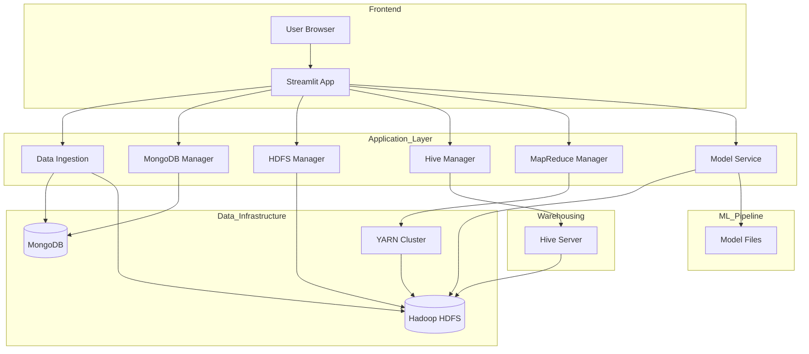
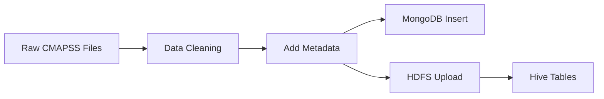

# 🏗️ System Architecture - NASA Turbojet Analytics Platform

This document describes the architectural design of the Big Data Analytics Platform developed for the NASA C-MAPSS dataset. The system follows a **Modern Data Stack** pattern, leveraging distributed storage, SQL warehousing, and Machine Learning services.

---

## 🌟 High-Level Overview

The platform uses a **Layered Architecture**:

1. **Presentation Layer**: Streamlit Dashboard for user interaction
2. **Application Layer**: Python Backend Managers for logic orchestration
3. **ML Layer**: Scikit-Learn Model Service for training and inference
4. **Data Layer**: MongoDB (Document Store) + HDFS (Data Lake) + Hive (Warehouse)

---

## 🏛️ Architecture Diagram



---

## 🐳 Docker Infrastructure

All services run in Docker containers managed by docker-compose:

| Container | Service | Ports | Purpose |
|-----------|---------|-------|---------|
| **namenode** | Hadoop NameNode + YARN | 9870, 8088 | HDFS master, Resource Manager |
| **datanode** | Hadoop DataNode | 9864 | HDFS storage worker |
| **hive-server** | Apache Hive | 10000 | SQL interface over HDFS |
| **mongodb** | MongoDB | 27017 | Document database |

---

## 🧩 Component Details

### 1. Presentation Layer (Frontend)

**Technology**: Streamlit with custom CSS

**Tabs**:
| Tab | Purpose |
|-----|---------|
| 🏠 Home | Overview and system status |
| 📤 Data Ingestion | ETL pipeline controls |
| 🔍 Data Exploration | Visualizations and statistics |
| 🍃 MongoDB Analytics | Aggregation queries |
| 🐘 HDFS Management | File browser and operations |
| 🐝 HiveQL Queries | SQL query execution |
| ⚡ MapReduce Jobs | YARN job execution |
| 🤖 RUL Prediction | ML training and inference |

---

### 2. Application Layer (Backend)

| Module | Responsibilities |
|--------|-----------------|
| `config.py` | Configuration and constants |
| `mongo_manager.py` | MongoDB CRUD + aggregations |
| `hdfs_manager.py` | HDFS file operations |
| `hive_manager.py` | Hive table management + 20 queries |
| `mapreduce_manager.py` | YARN job execution |
| `data_ingestion.py` | ETL pipeline |
| `model_service.py` | ML training and prediction |

---

### 3. Data Storage Layer

#### MongoDB (Document Store)
- **Purpose**: Primary storage for sensor data
- **Schema**: Flexible document model per reading
- **Indexes**: Compound indexes on `(dataset_id, unit_number, time_cycles)`
- **Features**: 8+ aggregation pipelines for analytics

#### Hadoop HDFS (Data Lake)
- **Purpose**: Scalable file storage for processed data
- **Structure**:
  ```
  /bda_project/
  ├── processed/
  │   ├── train/    # Training datasets (CSV)
  │   ├── test/     # Test datasets (CSV)
  │   └── rul/      # RUL ground truth (CSV)
  └── uploads/      # User uploads
  ```

#### Apache Hive (Data Warehouse)
- **Purpose**: SQL interface over HDFS data
- **Tables**: `cmapss_train`, `cmapss_test`, `cmapss_rul`
- **Type**: External tables (data resides in HDFS)

---

### 4. Processing Layer

#### MapReduce on YARN
- **Execution**: Jobs run on Hadoop YARN cluster
- **Available Jobs**:
  - Cycle Counter
  - Feature Summary
  - RUL Averaging

---

### 5. Machine Learning Layer

**Service**: `model_service.py`

**Algorithm**: Random Forest Regressor

**Workflow**:
1. **Training**: Fetch data from HDFS → Calculate RUL → Train model → Save `.pkl`
2. **Inference**: Load model → Get test data → Generate predictions

---

## 🔄 Data Flow Pipelines

### Pipeline 1: Data Ingestion



### Pipeline 2: Analytics Query


### Pipeline 3: ML Prediction


---

## 🔐 Configuration

Key settings in `backend/config.py`:

| Setting | Description |
|---------|-------------|
| `USE_DOCKER` | Enable Docker-based services |
| `NAMENODE_CONTAINER` | HDFS namenode container name |
| `MONGO_URI` | MongoDB connection string |
| `BATCH_SIZE` | Records per MongoDB batch |

---

## 📊 Performance Characteristics

| Operation | Typical Latency |
|-----------|-----------------|
| MongoDB aggregation | < 500ms |
| Hive simple query | 2-5 seconds |
| MapReduce job | 30-120 seconds |
| ML training (FD001) | 2-5 minutes |

---

## 🔗 Related Documentation

- [README.md](README.md) - Project overview
- [SETUP_GUIDE.md](SETUP_GUIDE.md) - Installation instructions
- [HIVEQL_QUERIES.md](HIVEQL_QUERIES.md) - Query reference
