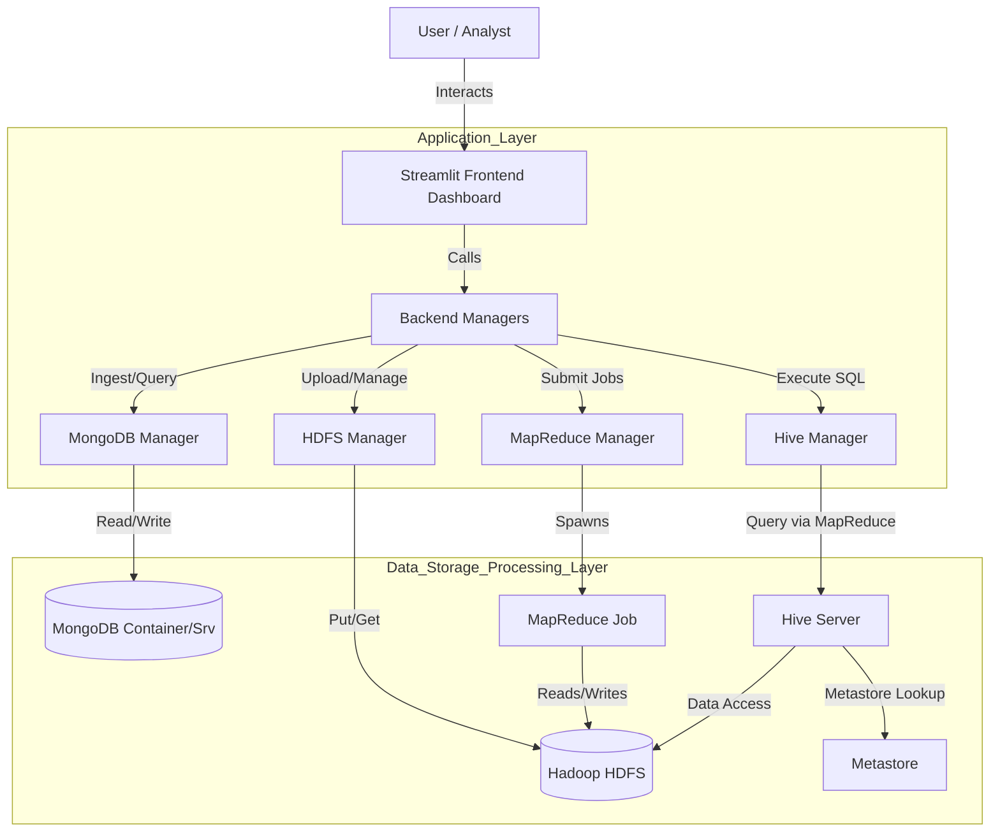

# 🏗️ System Architecture - Big Data Analytics Platform

This document describes the architectural design of the Big Data Analytics Platform developed for the NASA C-MAPSS (Turbofan Engine Degradation) dataset. The system integrates multiple big data technologies into a unified dashboard for ingestion, storage, processing, and analysis.

## 🌟 High-Level Overview

The platform follows a modular **Layered Architecture**, separating the presentation layer (frontend) from the data processing and storage layers (backend). It leverages a "Polyglot Persistence" approach, using **MongoDB** for flexible, document-oriented analytics and **HDFS** for distributed file storage, with **Hive** providing a structured SQL interface over the raw data.

### 🏛️ Architecture Diagram



---

## 🧩 Component Details

### 1. Presentation Layer (Frontend)
- **Technology**: [Streamlit](https://streamlit.io/) (Python)
- **Responsibility**: 
  - Provides an interactive web interface.
  - Handles user inputs for file uploads, job selection, and query execution.
  - Visualizes results using extensive charting (Line charts, Correlation matrices).
- **Key Modules**:
  - `app.py`: Entry point and UI layout manager.

### 2. Application Logic Layer (Backend)
- **Technology**: Python 3.8+
- **Responsibility**: Abstraction layer acting as a bridge between the UI and low-level Big Data services.
- **Key Modules** (`backend/`):
  - `mongo_manager.py`: Handles connection pooling, bulk ingestion, and Aggregation Pipelines for MongoDB.
  - `hdfs_manager.py`: Wraps Hadoop CLI logic (subprocess calls) to perform file operations (put, get, ls, rm).
  - `mapreduce_manager.py`: Orchestrates the execution of Python MapReduce scripts using `mrjob` or direct execution.
  - `hive_manager.py`: Manages Hive external table creation and query execution via CLI.

### 3. Data Storage & Processing Layer

#### A. MongoDB (NoSQL Store)
- **Role**: Operational Analytics Store.
- **Usage**:
  - Stores parsed sensor data as JSON documents.
  - Performs real-time aggregation (e.g., Average sensor readings per unit).
  - Powering the "Analytics Dashboard" for fast lookups.
- **Data Model**:
  ```json
  {
    "unit_number": 1,
    "time_cycles": 1,
    "op_setting_1": 42.00,
    "sensor_11": 47.2,
    ...
  }
  ```

#### B. Hadoop HDFS (Distributed Storage)
- **Role**: Data Lake / Raw Storage.
- **Usage**:
  - Stores the original raw text files (`train_FD004.txt`).
  - Acts as the source of truth for MapReduce jobs and Hive tables.
- **Structure**: `/user/hadoop/input/` (default ingestion path).

#### C. MapReduce (Batch Processing)
- **Role**: Computational Engine.
- **Technology**: Hadoop MapReduce framework (via `mrjob`).
- **Jobs**:
  - **Sensor Statistics**: Calculates Min, Max, Avg for specific sensors across the dataset.
  - **Operation Counts**: Computes total operational cycles per engine unit.

#### D. Hive (Data Warehousing)
- **Role**: Structured SQL Interface.
- **Usage**: allows running SQL-like queries on the unstructured data in HDFS.
- **Mechanic**: Uses `EXTERNAL TABLES` mapped to the HDFS directory. Data is not moved; Hive applies the schema on-read.

---

## 🔄 Data Pipeline Flows

### Flow 1: Ingestion & Fast Analytics
1. **User** selects a local dataset via Streamlit.
2. **MongoManager** parses the file into Pandas DataFrame.
3. **MongoManager** performs bulk insert into MongoDB collection `sensors`.
4. **Streamlit** triggers Aggregation Pipeline to update dashboards instantly.

### Flow 2: Batch Processing (MapReduce)
1. **User** uploads raw file to HDFS via **HDFSManager**.
2. **User** selects a job (e.g., Sensor Stats) and clicks run.
3. **MapReduceManager** submits the Python script to the Hadoop cluster (or simulate locally).
4. **Script** reads from HDFS, processes (Map -> Shuffle -> Reduce), and outputs results.
5. **Streamlit** captures `stdout`/`stderr` and displays the job report.

### Flow 3: Ad-Hoc Querying (Hive)
1. **User** initializes the Hive Table (schema applied to HDFS path).
2. **User** inputs a HiveQL query (e.g., `SELECT AVG(s11) FROM cmaps_sensors`).
3. **HiveManager** wraps the query in a shell command passed to the Hive Service.
4. **Hive** compiles the query into MapReduce tasks (Tez/MR), executes on HDFS data, and returns rows.
5. **Streamlit** formats the result as a table.

---

## 🛠️ Technology Stack Summary

| Component | Technology | Version / Note |
|:---|:---|:---|
| **Language** | Python | 3.8+ |
| **App Framework** | Streamlit | 1.30+ |
| **NoSQL DB** | MongoDB | Community Edition 6.0+ |
| **Distributed FS** | HDFS | Hadoop 3.x |
| **Batch Engine** | MapReduce | Hadoop Streaming / mrjob |
| **DW Interface** | Apache Hive | 3.x |
| **Driver / Libs** | PyMongo, Pandas | `pymongo`, `pandas` |

## 📐 Design Decisions & Trade-offs

1. **Subprocess Wrapper vs Native Clients**:
   - *Decision*: Used `subprocess` to call `hdfs` and `hive` CLI commands instead of using native Python libraries like `pyhive` or `hdfs` library connection modes.
   - *Reasoning*: Ensures compatibility with various local setups (Docker, Native Windows Hadoop) where libraries might have strict binding requirements (SASL, Thrift versions). It mimics how a user would interact with the terminal.

2. **External Tables in Hive**:
   - *Decision*: Used `EXTERNAL TABLE` instead of `MANAGED TABLE`.
   - *Reasoning*: Dropping the table in Hive should not delete the raw data in HDFS. This allows MongoDB and MapReduce to continue accessing the same file source without risk.

3. **Hybrid Storage**:
   - *Decision*: Storing data in both MongoDB and HDFS.
   - *Reasoning*: MongoDB offers superior performance for interactive dashboards (milliseconds latency), while HDFS provides the necessary infrastructure for scalable, batch-oriented heavy lifting (MapReduce).
