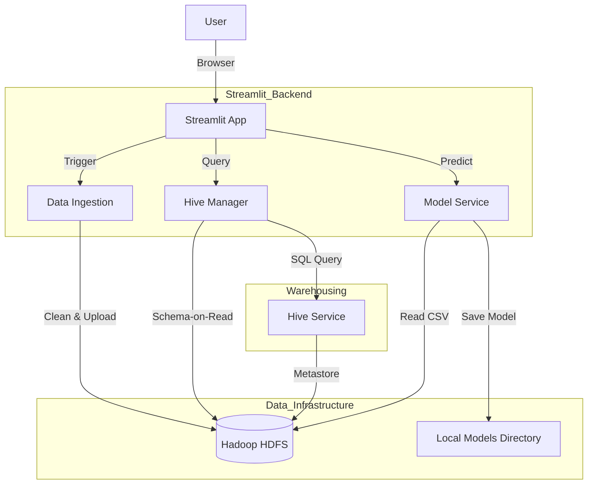

# 🏗️ System Architecture - Big Data Analytics Platform

This document describes the architectural design of the Big Data Analytics Platform developed for the NASA C-MAPSS dataset. The system follows a **Modern Data Stack** pattern, leveraging distributed storage, SQL warehousing, and Machine Learning services.

## 🌟 High-Level Overview

The platform uses a **Layered Architecture**:
1.  **Presentation Layer**: Streamlit Dashboard for user interaction.
2.  **Application Layer**: Python Backend Managers for logic orchestration.
3.  **ML Layer**: Scikit-Learn Model Service for training and inference.
4.  **Data Layer**: HDFS (Storage) and Hive (Warehousing).

### 🏛️ Architecture Diagram

---

## 🧩 Component Details

### 1. Presentation Layer (Frontend)
-   **Technology**: Streamlit
-   **Role**: Unified interface for Data Engineers (Pipeline management) and Analysts (Dashboards).
-   **Key Tabs**:
    -   **Data Pipeline**: Triggering ingestion jobs and Hive table creation.
    -   **Fleet Dashboard**: Visualizing sensor health.
    -   **Predictive Maintenance**: ML Model interaction.

### 2. Machine Learning Layer
-   **Service**: `backend/model_service.py`
-   **Algorithm**: Random Forest Regressor.
-   **Workflow**:
    1.  **Training**: Downloads processed CSVs from HDFS -> Calculates RUL -> Trains Model -> Serializes to `.pkl`.
    2.  **Inference**: Loads Model -> Downloads Test Data -> Generates RUL Predictions.

### 3. Data Storage & Processing Layer

#### A. Hadoop HDFS (Data Lake)
-   **Role**: Primary storage for processed CSV chips.
-   **Structure**:
    -   `/bda_project/processed/train/`
    -   `/bda_project/processed/test/`
    -   `/bda_project/processed/rul/`

#### B. Hive (Data Warehouse)
-   **Role**: SQL Interface.
-   **Tables**: `cmapss_train`, `cmapss_test`, `cmapss_rul`.
-   **Type**: External Tables (Data resides in HDFS).

---

## 🔄 Data Pipeline Flows

### Flow 1: Ingestion Pipeline
1.  **Scanner**: Detects raw files in `CMAPSS/`.
2.  **Cleaner**: Pandas reads variable-whitespace text files and normalizes to CSV.
3.  **Tagger**: Appends `dataset_id` (e.g., "FD001").
4.  **Uploader**: HDFS Manager puts files into partitioned HDFS directories.

### Flow 2: ML Training
1.  **Request**: User clicks "Train Model (FD001)".
2.  **Fetch**: Backend downloads `/processed/train/FD001.csv` from HDFS.
3.  **Feature Eng**: Calculates Target `RUL = Max(Time) - Current(Time)`.
4.  **Fit**: Random Forest trains on Sensors 1-21.
5.  **Save**: Model saved locally as `models/rul_model_FD001.pkl`.

### Flow 3: Fleet Dashboard
1.  User selects a Unit.
2.  Backend pulls relevant data chunk from HDFS.
3.  Plotly renders interactive time-series charts.
